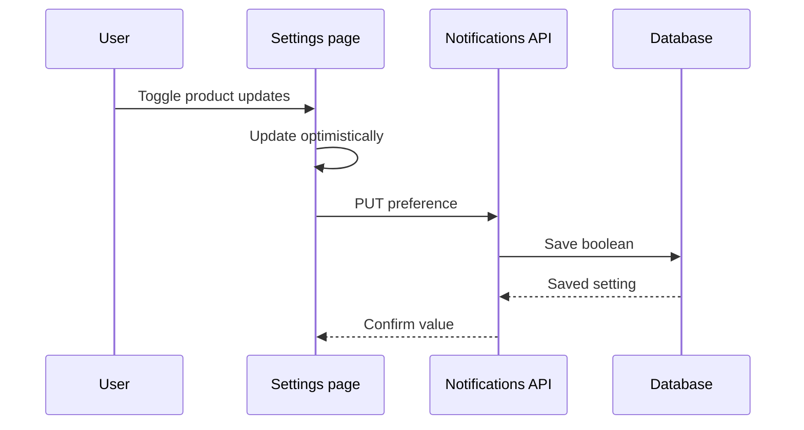

# Notification preferences — implementation plan

Status: ready for review

## Goal

Let signed-in users choose whether they receive product updates by email and save that preference immediately.

## Proposed approach

Add a `product_updates` boolean to the existing user settings record. The settings page will render a toggle that sends a `PUT /api/settings/notifications` request whenever its value changes.

The API will authenticate the current user, validate the boolean payload, update the setting, and return the saved value. The UI will optimistically update the toggle and revert it if the request fails.

## Implementation steps

1. Add the database field with a default of `true` for existing and new users.
2. Add a validated API route that reads and updates the notification preference.
3. Add the toggle to the account settings page with optimistic state and an inline error message.
4. Add tests for authorization, invalid payloads, successful updates, and UI rollback.

## Rollout

Deploy the migration and application together. No feature flag is required because the new field has a default and the UI change is backwards compatible.

## Risks

- Two browser tabs could overwrite each other because updates use last-write-wins semantics.
- An optimistic update may briefly display a value that the server rejects.
- Existing users will be opted in by default after migration.

## Review exercise

Select any sentence or step above, add an inline review comment, then press **Run review** in the comments sidebar. Useful review prompts include:

- “Do not opt existing users in without consent.”
- “Explain why this endpoint uses PUT instead of PATCH.”
- “Add a rollback step for the migration.”

## Review log

### 2026-07-18 — round 1

- Change the notification preference default to `false` → Updated the first implementation step and aligned the Risks section so existing and new users remain opted out by default.

### 2026-07-18 — round 2

- Change the notification preference default to `true` → Updated the first implementation step and aligned the Risks section so existing and new users are opted in by default.
